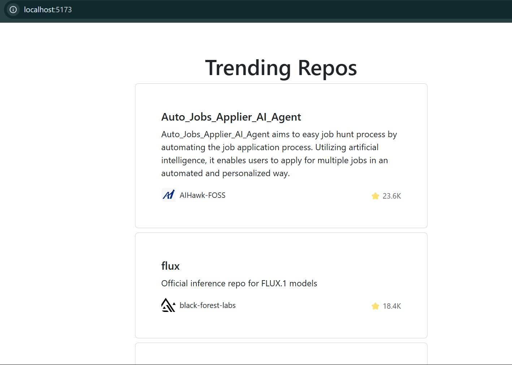
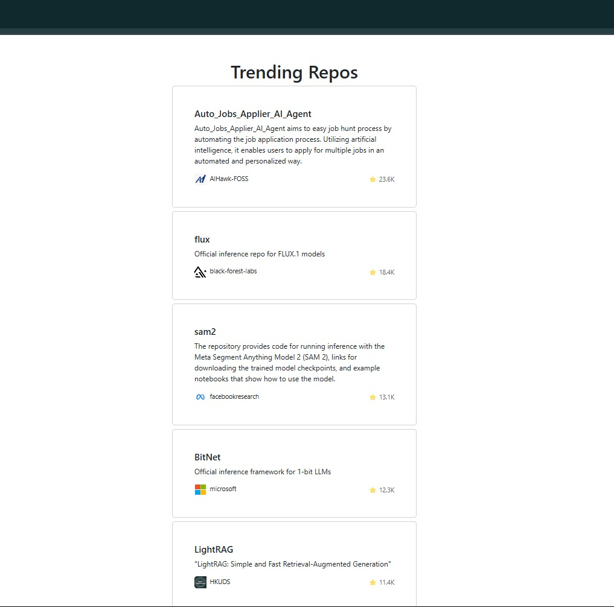
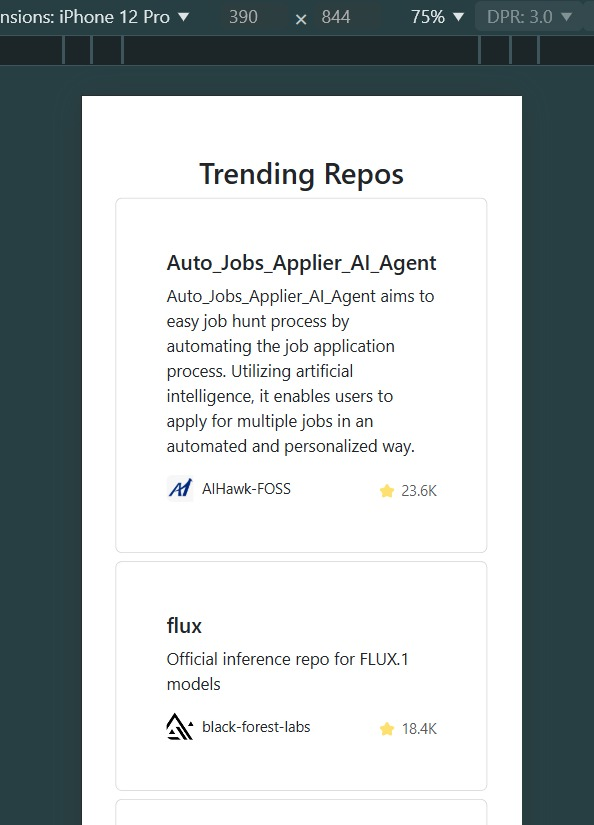

## Coding Challenge

### Task:
Implement a responsive web app using React.js that lists the most starred GitHub repositories created in the last 10 days.

### Features:
- As a user, I should see the most starred GitHub repositories that were created in the last 10 days.
- As a user, I should see the results displayed as an item list, with one repository per row.
- As a user, I should be able to see the following details for each repository:
  - **Repository Name**
  - **Repository Description**
  - **Number of Stars**
  - **Username and Avatar of the Owner**
- As a user, I should be able to scroll, and new results should appear with pagination.

### How to Fetch Data from GitHub:

To get the most starred repositories created in the last 10 days (with the current date as **2024-07-15**), call the following GitHub API endpoint:

https://api.github.com/search/repositories?q=created:>2024-07-15&sort=stars&order=desc

To fetch the 2nd page of results, append `&page=2`:

https://api.github.com/search/repositories?q=created:>2024-07-15&sort=stars&order=desc&page=2


For subsequent pages, increment the `page` parameter accordingly (e.g., `page=3`, `page=4`, etc.).

### Sample Page Output:
The page will display a list of repositories, showing:
- The **repository name**.
- The **repository description**.
- The **number of stars**.
- The **username and avatar** of the owner.

### Screenshots:




### Running the Project:

1. **Clone the repository:**

    ```bash
    git clone <repository-url>
    ```

2. **Install dependencies:**

    ```bash
    cd <project-directory>
    npm install
    ```

3. **Run the development server:**

    ```bash
    npm run dev
    ```

    The application will be accessible at [http://localhost:3000](http://localhost:3000).

4. **Build the project for production:**

    ```bash
    npm run build
    ```

5. **Serve the production build:**

    ```bash
    npm run serve
    ```

### API Rate Limits and Authentication:

GitHub's API enforces rate limits. For unauthenticated requests, the limit is quite low. To avoid hitting the rate limit quickly, use an **access token** to authenticate your requests. This will allow you a higher rate limit.

For more information, visit the [GitHub API Rate Limit documentation](https://docs.github.com/en/rest/overview/resources-in-the-rest-api#rate-limiting).

---

Thank you for reviewing this project. I look forward to your feedback! 😊
